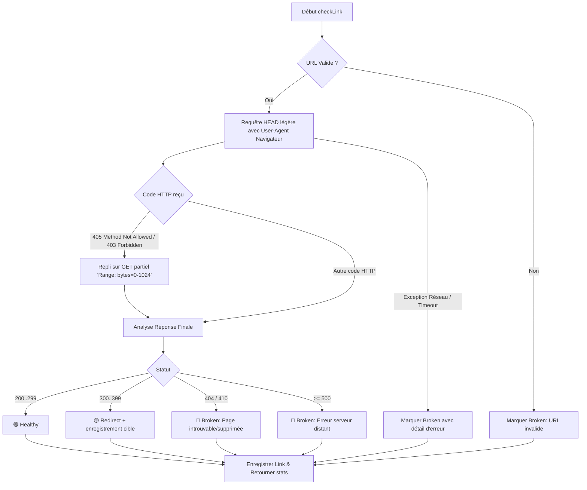

# 🩺 Scanner de Santé des Liens & Détecteur de Liens Morts

> **Documentation technique et fonctionnelle du module de vérification de disponibilité des liens.**  
> *Date d'implémentation : 1er Septembre 2026*  
> *Statut : 🟢 En production (Testé à 100% avec 8 tests dédiés)*

---

## 🧭 Sommaire

1. [Vue d'Ensemble & Objectifs](#1-vue-densemble--objectifs)
2. [Architecture Technique & Modélisation](#2-architecture-technique--modélisation)
3. [Moteur de Vérification HTTP (`LinkHealthService`)](#3-moteur-de-vérification-http-linkhealthservice)
4. [Exécution Asynchrone en File d'Attente (`CheckLinkHealthJob`)](#4-exécution-asynchrone-en-file-dattente-checklinkhealthjob)
5. [Commande Console Artisan (`links:check-health`)](#5-commande-console-artisan-linkscheck-health)
6. [Intégration dans l'Interface Filament](#6-intégration-dans-linterface-filament)
   - [6.1 Vue Table des Liens](#61-vue-table-des-liens)
   - [6.2 Vue Grille des Cartes](#62-vue-grille-des-cartes)
   - [6.3 Vue Fiche Détaillée](#63-vue-fiche-détaillée)
   - [6.4 Action d'En-Tête Globale](#64-action-den-tête-globale)
7. [Guide d'Utilisation & Cas d'Usage](#7-guide-dutilisation--cas-dusage)
8. [Suite de Tests Pest Automatisés](#8-suite-de-tests-pest-automatisés)

---

## 1. Vue d'Ensemble & Objectifs

Au fil du temps, de nombreux liens sauvegardés sur le Web deviennent inaccessibles (**liens morts**, erreurs 404, suppressions 410, pannes serveurs 500, domaines expirés) ou changent d'URL (**redirections permanentes** 301/302).

Le module **Link Health Scanner** de LinksVault répond à ces problématiques en offrant :
- Une **surveillance automatique et à la demande** de la disponibilité des URLs enregistrées.
- Une **classification claire de la santé** : 🟢 En ligne, 🟡 Redirection, 🔴 Lien mort, ⚪ Non vérifié.
- Une **résilience HTTP maximale** évitant les faux positifs causés par les pare-feux anti-bots (WAF/Cloudflare).
- Des **actions de correction et de diagnostic** directement intégrées dans le dashboard Filament.

---

## 2. Architecture Technique & Modélisation

### 2.1 Énumération `LinkHealthStatus`

Fichier : [`app/Enums/LinkHealthStatus.php`](file:///c:/Users/D3vOs/Projets/Laravel/Web/links-vault/app/Enums/LinkHealthStatus.php)

L'énumération implémente les contrats Filament `HasLabel`, `HasColor`, `HasIcon` :

| Valeur Enum | Libellé | Code HTTP Associé | Couleur Badge | Icône Tabler |
| :--- | :--- | :--- | :---: | :--- |
| `Healthy = 'healthy'` | **En ligne** | 200..299 | `success` (Vert) | `TablerIcon::CircleCheck` |
| `Redirect = 'redirect'` | **Redirection** | 301, 302, 307, 308 | `warning` (Orange) | `TablerIcon::ArrowRight` |
| `Broken = 'broken'` | **Lien mort** | 404, 410, 500, Timeout, DNS | `danger` (Rouge) | `TablerIcon::AlertTriangle` |
| `Unknown = 'unknown'` | **Non vérifié** | `null` | `gray` (Gris) | `TablerIcon::Help` |

### 2.2 Schéma de Base de Données

Migration : [`database/migrations/2026_09_01_000003_add_health_check_to_links_table.php`](file:///c:/Users/D3vOs/Projets/Laravel/Web/links-vault/database/migrations/2026_09_01_000003_add_health_check_to_links_table.php)

Colonnes ajoutées à la table `links` :
- `http_status` (`unsignedSmallInteger`, nullable) : Code HTTP renvoyé (ex: 200, 301, 404, 500).
- `health_status` (`string`, default: `'unknown'`) : Clé d'état de l'enum.
- `last_health_checked_at` (`timestamp`, nullable) : Date et heure du dernier test.
- `health_error` (`string(500)`, nullable) : Message explicatif en cas d'échec (ex: *« Page introuvable (404 Not Found) »*, *« Délai d'attente dépassé »*).
- `redirect_url` (`string(2083)`, nullable) : URL de destination finale en cas de redirection 301/302.

Indexation composite créée pour des requêtes ultra-rapides :  
`$table->index(['team_id', 'health_status', 'last_health_checked_at']);`

### 2.3 Modèle Eloquent `Link`

Fichier : [`app/Models/Link.php`](file:///c:/Users/D3vOs/Projets/Laravel/Web/links-vault/app/Models/Link.php)

Méthodes helpers disponibles sur le modèle :
```php
$link->isHealthy();   // bool (true si statut Healthy)
$link->isBroken();    // bool (true si statut Broken)
$link->isRedirect();  // bool (true si statut Redirect)
```

---

## 3. Moteur de Vérification HTTP (`LinkHealthService`)

Fichier : [`app/Services/LinkHealthService.php`](file:///c:/Users/D3vOs/Projets/Laravel/Web/links-vault/app/Services/LinkHealthService.php)

Le service est conçu pour minimiser la consommation de bande passante tout en contournant les protections anti-scraping strictes :



### Méthodes Clés :
1. `checkLink(Link $link): array` : Analyse un lien individuel et met à jour ses attributs en base de données.
2. `checkTeamLinks(Team $team, ?int $limit = null, bool $force = false): array` : Analyse les liens d'un espace de travail (avec filtre optionnel sur les liens obsolètes > 7 jours).
3. `checkCollection(Collection|array $links): array` : Analyse un lot de liens et retourne le bilan chiffré (`total`, `healthy`, `broken`, `redirect`).

---

## 4. Exécution Asynchrone en File d'Attente (`CheckLinkHealthJob`)

Fichier : [`app/Jobs/CheckLinkHealthJob.php`](file:///c:/Users/D3vOs/Projets/Laravel/Web/links-vault/app/Jobs/CheckLinkHealthJob.php)

Permet d'exécuter des scans massifs en arrière-plan sans bloquer les requêtes HTTP :

```php
use App\Jobs\CheckLinkHealthJob;

// 1. Pour un lien unique :
CheckLinkHealthJob::dispatch(link: $link);

// 2. Pour une sélection d'identifiants :
CheckLinkHealthJob::dispatch(linkIds: [12, 15, 28, 45]);

// 3. Pour tous les liens d'une équipe :
CheckLinkHealthJob::dispatch(team: $team, force: false);
```

---

## 5. Commande Console Artisan (`links:check-health`)

Fichier : [`app/Console/Commands/CheckLinksHealthCommand.php`](file:///c:/Users/D3vOs/Projets/Laravel/Web/links-vault/app/Console/Commands/CheckLinksHealthCommand.php)

Une commande puissante et interactive avec barre de progression et tableau récapitulatif pour les administrateurs et tâches cron serveur.

### Syntaxe & Options :

```bash
# Vérifier les liens non vérifiés ou anciens (> 7 jours) par défaut :
php artisan links:check-health

# Vérifier uniquement une équipe spécifique :
php artisan links:check-health --team=3

# Forcer la réévaluation de tous les liens (même récemment vérifiés) :
php artisan links:check-health --force

# Vérifier l'ensemble absolu des liens de la base de données :
php artisan links:check-health --all --limit=500
```

### Exemple de sortie terminal :
```text
🩺 Démarrage du scan de santé des liens...
Analyse des liens non vérifiés ou anciens (> 7 jours)...
Analyse de 42 lien(s) en cours...
 [============================] 100%

+--------------------------------+--------+
| Métrique                       | Nombre |
+--------------------------------+--------+
| Total vérifiés                 | 42     |
| 🟢 En ligne (200 OK)           | 38     |
| 🟡 Redirections (301/302)      | 2      |
| 🔴 Liens morts / Inaccessibles | 2      |
+--------------------------------+--------+
🎉 Scan de santé terminé avec succès !
```

---

## 6. Intégration dans l'Interface Filament

### 6.1 Vue Table des Liens (`LinksTable`)
- **Colonne Santé** : Affiche un badge dynamique (`200 OK`, `301 Redir`, `404 Mort`, etc.) avec couleur adaptée et infobulle explicative au survol.
- **Filtre `Santé du lien`** : Permet d'isoler instantanément les liens morts pour les nettoyer ou corriger.
- **Action de ligne `Tester la disponibilité`** : Teste le lien en temps réel en 1 clic et affiche une notification Filament avec le résultat.
- **Action en masse (Bulk Action)** : Permet de sélectionner plusieurs liens et de déclencher une analyse groupée.

### 6.2 Vue Grille des Cartes (`link-card`)
- Pastille d'état visuelle superposée sur le coin supérieur gauche de l'image (badge vert `200`, ambre `301`, ou rouge `Mort`).

### 6.3 Vue Fiche Détaillée (`ViewLink`)
- Badge d'état dans l'en-tête à côté du type de contenu.
- Bouton d'action directe « 🩺 Tester la disponibilité » dans la colonne latérale d'actions rapides.

### 6.4 Action d'En-Tête Globale (`ListLinks`)
- Bouton « **🩺 Scanner la santé** » dans la barre d'outils supérieure ouvrant une boîte modale avec 3 options de périmètre :
  1. *Liens non vérifiés ou anciens (> 7 jours) [Recommandé]*
  2. *Tous les liens de l'espace de travail*
  3. *Revérifier uniquement les liens actuellement marqués comme morts*

---

## 7. Guide d'Utilisation & Cas d'Usage

### Cas d'usage 1 : Détecter et corriger une URL cassée
1. Rendez-vous dans la liste des liens.
2. Ouvrez les filtres et sélectionnez **Santé du lien** ➔ **Lien mort**.
3. Consultez l'infobulle pour voir l'erreur exacte (ex: *404 Not Found*).
4. Cliquez sur **Modifier** pour corriger l'URL ou **Supprimer**.

### Cas d'usage 2 : Mise à jour automatique des redirections
1. Filtrez sur **Santé du lien** ➔ **Redirection**.
2. L'infobulle ou la notification affiche l'URL cible (ex: `https://site.com/nouvelle-page`).
3. Vous pouvez copier la nouvelle URL et mettre à jour votre fiche.

---

## 8. Suite de Tests Pest Automatisés

Fichier : [`tests/Feature/LinkHealthTest.php`](file:///c:/Users/D3vOs/Projets/Laravel/Web/links-vault/tests/Feature/LinkHealthTest.php)

L'ensemble des scénarios est testé de manière étanche via `Http::preventStrayRequests()` et `Http::fake()` :

| Test | Scénario Testé | Résultat |
| :--- | :--- | :---: |
| `it can detect a healthy link returning 200 OK` | Vérifie la détection d'un code 200 et la mise à jour des attributs. | ✅ Passé |
| `it can detect a broken link returning 404 Not Found` | Vérifie la détection 404 et le message d'erreur. | ✅ Passé |
| `it can detect a server error 500 as broken` | Vérifie le statut Broken sur erreur 500. | ✅ Passé |
| `it handles network connection timeouts gracefully` | Simule un échec de connexion réseau / timeout sans planter. | ✅ Passé |
| `it handles invalid URLs without throwing exceptions` | Vérifie le comportement sur chaînes non URLs. | ✅ Passé |
| `it can check multiple links for a team and return stats` | Vérifie l'agrégation statistique pour une équipe. | ✅ Passé |
| `it executes CheckLinkHealthJob asynchronously` | Vérifie le traitement par Job de file d'attente. | ✅ Passé |
| `artisan links:check-health command runs successfully` | Vérifie l'exécution sans erreur de la commande CLI. | ✅ Passé |

Exécution des tests :
```bash
php artisan test --filter=LinkHealthTest
```
