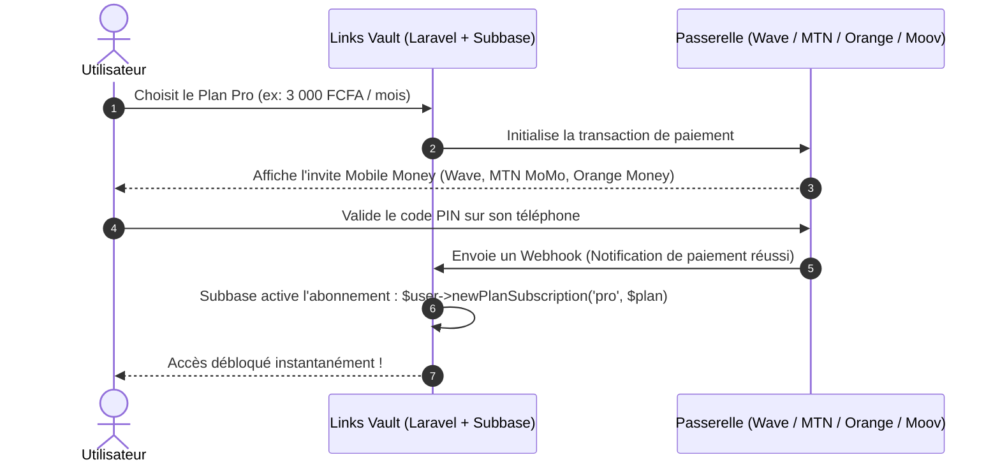

Read URL: https://filamentphp.com/plugins/nafis-watsiq-subbase
Viewed content.md:1-800
Searched for "nafis-watsiq"
Searched for "Subbase"
Searched web: ""nafis-watsiq" subbase filament OR laravel"
Searched web: ""nafiswatsiq/subbase" OR "laravelcm/laravel-subscriptions" payment gateway stripe paystack flutterwave"

**Oui, absolument ! C'est un excellent choix pour ce besoin.** 🚀

Voici une analyse détaillée de ce que fait ce package et comment l'utiliser avec des agrégateurs de paiement africains :

---

### 1. 🎯 Ce que fait le package `Subbase`

`Subbase` est un plugin officiel Filament (basé sur le moteur `laravelcm/laravel-subscriptions`) qui s'occupe de **toute la logique métier SaaS & abonnements** directement dans votre panel Filament :

* **Gestion des Plans & Tarifs** : Création de plans (ex: *Gratuit*, *Pro*, *Entreprise*), facturation mensuelle / annuelle, périodes d'essai (*Trial*).
* **Multi-devises natif** : Gestion des prix en **XOF**, **XAF**, **NGN**, **EUR**, **USD**, etc.
* **Fonctionnalités & Quotas (Feature Tracking)** : Définition de limites par plan (ex: *max 100 liens pour le plan gratuit, liens illimités pour le plan Pro*, *accès au résumé IA réservé au plan Pro*).
* **Codes promo & Réductions** : Moteur de coupons de réduction.
* **Cycle de vie de l'abonnement** : Gestion automatique des statuts (*Actif*, *En essai*, *Expiré*, *Annulé*).

---

### 2. 🌍 Est-il compatible avec les agrégateurs africains (Mobile Money / Carte) ?

**OUI, à 100 %, car Subbase est « Gateway-Agnostic » (indépendant de la passerelle de paiement).**

Contrairement à *Laravel Cashier* qui vous enferme sur Stripe ou Paddle, `Subbase` gère **les droits et l'état de l'abonnement** en base de données sans vous forcer à utiliser Stripe. Vous pouvez donc brancher n'importe quel agrégateur africain :

* **FedaPay** (Bénin, Togo, Côte d'Ivoire, Sénégal, Niger)
* **Paystack** (Nigeria, Ghana, Afrique du Sud, Kenya, Côte d'Ivoire)
* **Flutterwave** (Panafricain : 30+ pays, Mobile Money + Cartes)
* **CinetPay** (Afrique de l'Ouest & Centrale : Orange Money, MTN MoMo, Wave, Moov)
* **Kkiapay** (Bénin, Togo, Côte d'Ivoire)

---

### 3. 🔄 Comment fonctionne l'intégration en pratique ?

Le flux est très simple et standard :

---

### 4. 💡 En résumé : Est-ce recommandé ?

| Critère | Avis | Détail |
| :--- | :---: | :--- |
| **Prêt pour Filament v5** | ✅ | Interface d'administration intégrée sans coder de back-office. |
| **Multi-tenancy / Teams** | ✅ | Compatible avec votre modèle `User` ou `Team`. |
| **Paiements Afrique (Mobile Money)** | ✅ | Vous conservez le contrôle total sur vos webhooks de paiement. |
| **Gestion des quotas (ex: limite de liens)** | ✅ | Permet de bloquer la création de liens si le quota du plan est atteint. |