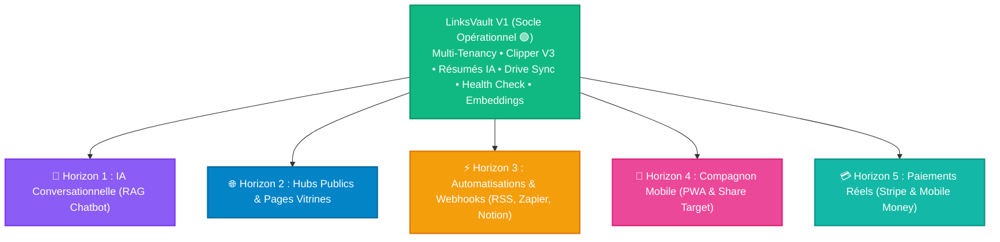

# 🚀 Roadmap LinksVault V2 — Nouvel Horizon & Évolutions Stratégiques

> **Document :** Feuille de Route Stratégique V2  
> **Date de Création :** 1er Septembre 2026  
> **Statut de la V1 :** 🟢 **100% Terminée & Opérationnelle (78 tests passants)**  
> **Objectif V2 :** Transformer LinksVault d'un gestionnaire de liens intelligent en un **Hub de Connaissances Connecté, Collaboratif et Monétisé à l'Échelle Globale**.

---

## 🗺️ Vue d'Ensemble & Architecture des 5 Horizons



---

## 📊 Matrice Synthétique des Horizons V2

| Horizon | Domaine | Valeur Ajoutée & Objectifs Clés | Effort Estimé | Priorité Conseillée |
|---|---|---|:---:|:---:|
| **Horizon 1** | **🤖 IA Conversationnelle (RAG)** | Chat interactif avec son coffre-fort de liens, citations directes, détection de doublons sémantiques. | Moyen (2-3 j) | 🌟🌟🌟🌟🌟 **(P1)** |
| **Horizon 2** | **🌐 Hubs Publics & Vitrines** | Pages publiques de collections partagées (ex: `/hub/@user/collection`), SEO OpenGraph, protection mot de passe. | Faible-Moyen (2 j) | 🌟🌟🌟🌟 **(P2)** |
| **Horizon 3** | **⚡ Automatisations & Connecteurs** | Ingestion automatique de flux RSS, Webhooks entrants/sortants (Zapier/Make/Slack), sync Notion/Obsidian. | Moyen (2 j) | 🌟🌟🌟🌟 **(P3)** |
| **Horizon 4** | **📱 Mobile PWA & Share Target** | PWA installable sur iOS/Android, intégration au menu « Partager » du téléphone (Web Share Target API), mode hors-ligne. | Moyen (2 j) | 🌟🌟🌟 **(P4)** |
| **Horizon 5** | **💳 Monétisation & Passerelles Réelles** | Stripe Checkout (CB), Mobile Money (Wave / Orange Money via Paystack/CinetPay), gestion des abonnements. | Moyen (2 j) | 🌟🌟🌟🌟 **(P5)** |

---

## 🔍 Détail Approfondi des Spécifications Techniques

---

### 🔹 Horizon 1 : IA Conversationnelle & « Chat avec son Coffre-fort » (RAG) 🤖

Exploiter les vecteurs d'embeddings (`laravel/ai`) déjà implémentés pour offrir une expérience conversationnelle de question-réponse sur l'ensemble de ses liens.

#### 1.1 Moteur RAG (Retrieval-Augmented Generation)
- **Pipeline de Question-Réponse** :
  1. L'utilisateur pose une question en langage naturel (ex: *« Quels sont les meilleurs outils d'authentification Laravel que j'ai sauvegardés ? »*).
  2. Le système vectorise la question et effectue une recherche sémantique multi-tenant sur les embeddings des liens (`links.embedding`).
  3. Les $K$ liens les plus pertinents (titres, résumés IA, points clés, descriptions) sont injectés comme contexte dans le prompt d'un agent LLM (`Laravel\Ai`).
  4. L'IA génère une synthèse fluide et structurée avec renvois numérotés vers les liens sources.
- **Citations & Sources Interactives** :
  - Chaque affirmation fait référence à une source cliquable ouvrant directement la fiche ou le lien d'origine.

#### 1.2 Détecteur de Doublons Sémantiques
- Lors de la capture d'un lien (via l'extension ou le web), calcul de similarité cosinus avec la base existante.
- Si un lien traitant exactement du même sujet existe déjà avec un score $> 85\%$, affichage d'une alerte non-bloquante avec proposition de fusionner les tags ou d'ajouter une note.

#### 1.3 Interface Utilisateur (Filament)
- Bouton flottant ou action d'en-tête **« 💬 Discuter avec mon Vault »**.
- Panneau latéral / modale de chat avec streaming temps réel (`Laravel\Ai` streaming), historique de conversation et suggestions de requêtes.

---

### 🔹 Horizon 2 : Hubs Publics & Pages Vitrines Personnalisées 🌐

Permettre aux utilisateurs et équipes de publier des collections thématiques de liens accessibles publiquement pour leur communauté, leurs clients ou leurs collègues.

#### 2.1 Moteur de Publication de Collections
- Transformation d'un dossier (`Folder`) ou d'une sélection de liens en **Hub Public**.
- URL unique et soignée : `https://linksvault.app/hub/@{username}/{collection-slug}`.
- Gestion du statut de publication : *Brouillon*, *Public*, *Protégé par mot de passe*, *Lien secret temporaire*.

#### 2.2 Personnalisation Visuelle & Branding
- Choix de la disposition : Grille de cartes visuelles, liste épurée, ou timeline chronologique.
- Personnalisation de l'en-tête : Titre, avatar / logo, bannière, description markdown, liens sociaux.
- Support natif du Mode Sombre / Clair automatique.
- Métadonnées SEO et balises OpenGraph dynamiques (aperçu riche sur Twitter/X, LinkedIn, Discord).

#### 2.3 Analytics & Engagement des Hubs
- Compteur de vues uniques et de clics sur chaque lien du Hub.
- Possibilité pour les visiteurs d'exporter la collection en 1 clic (HTML / JSON) ou de l'importer dans leur propre compte LinksVault.

---

### 🔹 Horizon 3 : Automatisations, Webhooks & Connecteurs Écosystème ⚡

Faire de LinksVault le carrefour central de veille et d'organisation documentaire.

#### 3.1 Aspiration & Veille Automatique de Flux RSS
- Ajout d'une source RSS (blog tech, site d'actualité, chaîne YouTube, newsletter).
- Commande planifiée (`links:sync-rss`) récupérant automatiquement les nouveaux articles.
- Génération automatique du résumé IA et auto-tagging à l'arrivée de chaque article.

#### 3.2 Système de Webhooks Entrants & Sortants
- **Webhooks Sortants** : Déclenchés lors des événements `link.created`, `link.ai_summarized`, `link.broken_detected`.
  - Intégration facile avec **Zapier**, **Make**, **n8n**, **Slack** et **Discord**.
- **Webhooks Entrants (API Ingestion)** : Endpoint sécurisé avec clé d'API pour permettre à des scripts externes ou des bots de déposer des liens directement dans un dossier spécifique.

#### 3.3 Connecteurs vers Outils de Prise de Notes
- **Notion** : Synchronisation des liens et résumés IA vers une base de données Notion.
- **Obsidian / Markdown** : Export automatique sous forme de notes Markdown avec frontmatter YAML.
- **Readwise / Pocket** : Importation continue des articles surlignés.

---

### 🔹 Horizon 4 : Application Compagnon Mobile (PWA & Share Target) 📱

Offrir une expérience mobile de capture instantanée sans friction sur smartphones et tablettes.

#### 4.1 Progressive Web App (PWA) Installable
- Fichier `manifest.json` enrichi avec icônes adaptatives, splash screen et couleur de thème.
- Service Worker pour la mise en cache des assets et un temps de chargement instantané.
- Installation en 1 clic sur l'écran d'accueil iOS (Safari) et Android (Chrome).

#### 4.2 Web Share Target API (Capture Système 1-Clic)
- Enregistrement de LinksVault comme destination de partage sur le système d'exploitation mobile.
- Depuis Safari, YouTube, Twitter/X ou Chrome sur smartphone, l'utilisateur clique sur « Partager » ➔ sélectionne **LinksVault** ➔ le lien et son contexte sont capturés automatiquement.

#### 4.3 Expérience Mobile & Mode Hors-ligne
- Navigation optimisée pour le tactile (gestes de balayage / swipe pour mettre en favori ou archiver).
- Consultation des résumés IA et métadonnées hors-ligne avec synchronisation dès reconnexion.

---

### 🔹 Horizon 5 : Monétisation en Production & Passerelles Réelles 💳

Brancher les flux financiers réels sur le système de quotas et abonnements déjà modélisé en V1 ([`SubscriptionQuotaService`](app/Services/SubscriptionQuotaService.php)).

#### 5.1 Passerelle Internationale (Stripe)
- **Stripe Checkout** : Redirection sécurisée pour l'achat des abonnements Pro (4.99 €/mois) et Team (14.99 €/mois).
- **Stripe Customer Portal** : Interface en libre-service pour la gestion des cartes bancaires, téléchargement des factures PDF et changement de formule.
- **Gestion des Webhooks Stripe** :
  - `checkout.session.completed` : Activation immédiate du plan.
  - `invoice.payment_succeeded` : Prolongation de la période de facturation et reset mensuel du quota de résumés IA.
  - `customer.subscription.deleted` : Rétrogradation automatique vers le plan Gratuit.

#### 5.2 Passerelle Régionale Mobile Money (Afrique / FCFA XOF)
- Intégration via **Paystack**, **CinetPay** ou **Flutterwave** pour les paiements locaux :
  - **Wave**
  - **Orange Money**
  - **MTN MoMo**
  - **Moov Money**
- Prise en charge des prix en FCFA (ex: 3 000 FCFA/mois pour Pro, 9 000 FCFA/mois pour Team).
- Validation instantanée par webhook avec notification push/email à l'utilisateur.

---

## 🛠️ Ordre d'Implémentation Conseillé pour la Reprise

```
1. 🤖 Étape 1 : Horizon 1 — Chat RAG Conversationnel avec les liens (Exploite immédiatement les embeddings V1)
2. 🌐 Étape 2 : Horizon 2 — Hubs Publics & Partage de Collections
3. ⚡ Étape 3 : Horizon 3 — Ingestion RSS & Webhooks Zapier/Make
4. 💳 Étape 4 : Horizon 5 — Passerelle de Paiement Réelle (Stripe / Mobile Money)
5. 📱 Étape 5 : Horizon 4 — PWA Mobile & Web Share Target
```

---
*Document de référence stratégique V2 — Prêt pour le lancement des développements.*
