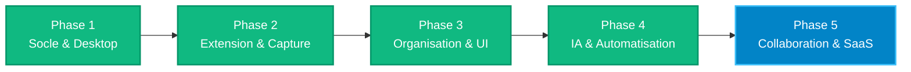

# 🚀 Roadmap LinksVault — Vision & Plan de Développement

Ce document définit les étapes clés, les priorités et l'architecture fonctionnelle pour faire de **LinksVault** la solution ultime de gestion intelligente de liens et de connaissances (Web, Desktop & Extension).

---

---

## 📌 Synthèse des Phases

| Phase | Domaine | Objectifs Principaux | Statut |
|---|---|---|:---:|
| **Phase 1** | **Socle & Desktop** | Multi-tenancy, Auth, Packaging NativePHP Electron Windows/macOS, Directives Blade | 🟢 **Terminé (100%)** |
| **Phase 2** | **Extension Clipper** | Capture 1-clic, extraction OpenGraph/YouTube, Token Sanctum, Popup WebExtension | 🟢 **Terminé (100%)** |
| **Phase 3** | **Organisation & UX** | Vues Grille/Table, Favoris ⭐, Palette Ctrl+K, Recherche instantanée, SPA wire:navigate | 🟢 **Terminé (100%)** |
| **Phase 4** | **IA & Intelligence** | Résumés automatiques, points clés, auto-tagging (Laravel AI SDK) | 🟢 **Terminé (100%)** |
| **Phase 5** | **Collaboration & SaaS** | Subbase Abonnements, Export/Import (Pocket/Chrome), Sync Cloud | 🟡 **Prochaine étape** |

---

## 🎯 Détail des Jalons

### 🔹 Phase 1 : Socle Technique, Authentification & Desktop 🟢
- [x] **Multi-Tenancy (FilaTeams)** : Espaces personnels automatiques + équipes partagées.
- [x] **Authentification & Permissions** : Filament v5 Auth, rôles (Propriétaire, Admin, Membre).
- [x] **NativePHP Desktop** : Configuration de la fenêtre Electron, persistance des états, MenuBar System Tray.
- [x] **Directives Blade par Plateforme** : `@desktop`, `@web`, `@mobile`, `@windows`, `@mac`.
- [x] **Suite de tests automatisés** : 36 tests unitaires et fonctionnels passants (130 assertions).
- [x] **Identité visuelle** : Intégration du logo HD sur tous les panels et fenêtres.

---

### 🔹 Phase 2 : Extension Navigateur & Moteur de Capture 🟢
- [x] **API Backend Sanctum** : Endpoints `/api/user/teams`, `/api/folders`, `/api/links`.
- [x] **Interface Popup WebExtension** : Formulaire de capture, sélecteur d'espace et de dossier.
- [x] **Capture intelligente des métadonnées** : Extraction automatique : Titre, Favicon, Description, Image OpenGraph, Détecteur YouTube HD.
- [x] **Tests & Packaging Navigateur** : Chargement dans Chrome/Brave/Edge et validation de bout en bout.
- [x] **Menu contextuel navigateur** : Enregistrer un lien ou une sélection en un clic droit.

---

### 🔹 Phase 3 : Organisation Avancée & Expérience Utilisateur (UI/UX) 🟢
- [x] **Vues dynamiques personnalisables** :
  - [x] **Vue Cartes (Grid)** avec aperçus 16:9, badges et favoris interactifs.
  - [x] **Vue Table classique** pour la gestion tabulaire et les actions en masse.
  - [x] **Bascule dynamique Grille / Table** avec mémorisation de l'état.
- [x] **Bouton Favoris ⭐ interactif** : Bascule instantanée sans rechargement.
- [x] **Palette de Commandes globale (`Ctrl + K`)** : Recherche rapide et navigation clavier.
- [x] **Moteur de Recherche plein texte** : Titre, URL, description, objectif, dossier, catégorie.
- [x] **Navigation SPA fluide** : Attributs `wire:navigate` sur tous les liens des cartes.

---

### 🔹 Phase 4 : Intelligence Artificielle & Analyse (Laravel AI SDK) 🟢
- [x] **Agent de Résumé Structuré (`LinkSummaryAgent`)** : Résumé concis (TL;DR), 3 points clés, catégorie et tags suggérés.
- [x] **Exécution Asynchrone (Queue Job)** : `GenerateLinkAiSummaryJob` en tâche de fond pour l'extension et le web.
- [x] **Actions Filament 1-Clic** : Bouton « ✨ Résumé IA » sur la table et la fiche détaillée (`ViewLink`).
- [x] **Auto-Tagging Intelligent** : Attribution automatique des tags pertinents.
- [x] **Gestion des Statuts IA** : `pending` ➔ `processing` (pulsant) ➔ `completed` / `failed`.

---

### 🔹 Phase 5 : Collaboration, Import/Export & Monétisation 🟡 *(Prochaine étape)*
- [ ] **Importateur universel** : Import des signets Chrome, Firefox, Safari, Pocket, Raindrop.io et CSV.
- [ ] **Exportation complète** : Formats JSON et HTML Netscape standard.
- [ ] **Gestion des Abonnements (Subbase)** : Plans Gratuit / Pro / Équipe.
