```mermaid
graph LR
    P1["Phase 1<br/>Socle & Desktop"] --> P2["Phase 2<br/>Extension & Capture"]
    P2 --> P3["Phase 3<br/>Organisation & UI"]
    P3 --> P4["Phase 4<br/>IA & Intelligence"]
    P4 --> P5["Phase 5<br/>Cloud & Sauvegardes"]
    P5 --> P6["Phase 6<br/>Monétisation SaaS"]
    P6 --> P7["Phase 7<br/>Recherche Sémantique"]
    P7 --> P8["Phase 8<br/>Santé & Analytics"]
    P8 --> P9["Phase 9<br/>Distribution & Stores"]
    
    style P1 fill:#10b981,stroke:#059669,stroke-width:2px,color:#fff
    style P2 fill:#10b981,stroke:#059669,stroke-width:2px,color:#fff
    style P3 fill:#10b981,stroke:#059669,stroke-width:2px,color:#fff
    style P4 fill:#10b981,stroke:#059669,stroke-width:2px,color:#fff
    style P5 fill:#10b981,stroke:#059669,stroke-width:2px,color:#fff
    style P6 fill:#0284c7,stroke:#38bdf8,stroke-width:2px,color:#fff
    style P7 fill:#8b5cf6,stroke:#7c3aed,stroke-width:2px,color:#fff
    style P8 fill:#f59e0b,stroke:#d97706,stroke-width:2px,color:#fff
    style P9 fill:#ec4899,stroke:#db2777,stroke-width:2px,color:#fff
```

# 🚀 Roadmap LinksVault — Vision & Plan de Développement

Ce document définit les étapes clés, les priorités et l'architecture fonctionnelle pour faire de **LinksVault** la solution ultime de gestion intelligente de liens et de connaissances (Web, Desktop & Extension).

---



---

## 📌 Synthèse de l'Avancement Global

| Phase | Domaine | Objectifs Principaux | Statut |
|---|---|---|:---:|
| **Phase 1** | **Socle & Desktop** | Multi-tenancy, Auth, Packaging NativePHP Electron Windows/macOS, Directives Blade | 🟢 **Terminé (100%)** |
| **Phase 2** | **Extension Clipper** | Capture 1-clic, extraction OpenGraph/YouTube, Token Sanctum, Popup WebExtension | 🟢 **Terminé (100%)** |
| **Phase 3** | **Organisation & UX** | Vues Grille/Table, Favoris ⭐, Palette Ctrl+K, Recherche instantanée, SPA wire:navigate | 🟢 **Terminé (100%)** |
| **Phase 4** | **IA & Intelligence** | Résumés automatiques, points clés, auto-tagging (Laravel AI SDK) | 🟢 **Terminé (100%)** |
| **Phase 5** | **Cloud & Sauvegardes** | Google Drive OAuth 1-clic, Sauvegarde locale chiffrée, Restauration 1-clic, Tracking | 🟢 **Terminé (100%)** |
| **Phase 6** | **Santé des Liens (Health)** | Détecteur de liens morts (HTTP 200/404/500, timeouts, redirections), Badges, Filtres & Scan en masse | 🟢 **Terminé (100%)** |
| **Phase 7** | **Monétisation SaaS** | Plans tarifaires (*Free/Pro/Team*), Gestion des quotas & limites (Subbase/Stripe) | 🔵 **À venir (Prochaine Étape)** |
| **Phase 8** | **Recherche Sémantique** | Embeddings vectoriels, Recherche par concept / intention (`laravel/ai` vectors) | 🟣 **À venir (Priorité 2)** |
| **Phase 9** | **Distribution Finale** | Package Chrome/Firefox Store, Builds installateurs Windows (`.exe`) & macOS (`.dmg`) | 🔴 **À venir (Phase Finale)** |

---

## 🎯 Détail des Réalisations (Terminé 🟢)

### 🔹 Phase 1 : Socle Technique, Authentification & Desktop 🟢
- [x] **Multi-Tenancy (FilaTeams)** : Espaces personnels automatiques + équipes partagées étanches.
- [x] **Authentification & Permissions** : Filament v5 Auth, rôles (Propriétaire, Admin, Membre).
- [x] **Page Profil Utilisateur Pleine Page (`EditProfile`)** : Formulaire multi-tenant (`Width::Full`) avec Nom, Email (validation unicité), Fuseau horaire, Langue (Français/English) et sécurité mot de passe.
- [x] **NativePHP Desktop** : Configuration de la fenêtre Electron, persistance des états, MenuBar System Tray, synchronisation SQLite (`nativephp.sqlite`).
- [x] **Directives Blade par Plateforme** : `@desktop`, `@web`, `@mobile`, `@windows`, `@mac`.
- [x] **Identité visuelle** : Intégration du logo HD vectoriel sur tous les panels et fenêtres.

---

### 🔹 Phase 2 : Extension Navigateur & Moteur de Capture 🟢
- [x] **API Backend Sanctum** : Endpoints `/api/auth/token`, `/api/context`, `/api/links`.
- [x] **Interface Popup WebExtension** : Formulaire de capture, sélecteur d'espace et de dossier.
- [x] **Capture intelligente des métadonnées** : Extraction automatique : Titre, Favicon, Description, Image OpenGraph, Détecteur YouTube HD.
- [x] **Tests & Validation Navigateur** : Chargement dans Chrome/Brave/Edge et validation de bout en bout.
- [x] **Menu contextuel navigateur** : Enregistrer un lien ou une sélection en un clic droit.

---

### 🔹 Phase 3 : Organisation Avancée & Expérience Utilisateur (UI/UX) 🟢
- [x] **Vues dynamiques personnalisables** :
  - [x] **Vue Cartes (Grid)** avec aperçus 16:9, badges et favoris interactifs.
  - [x] **Vue Table classique** épurée avec boutons icônes, tooltips et regroupement d'actions.
  - [x] **Bascule dynamique Grille / Table** avec mémorisation de l'état en session.
- [x] **Bouton Favoris ⭐ interactif** : Bascule instantanée sans rechargement.
- [x] **Palette de Commandes globale (`Ctrl + K`)** : Recherche rapide et navigation clavier.
- [x] **Moteur de Recherche plein texte** : Titre, URL, description, objectif, dossier, catégorie.
- [x] **Navigation SPA fluide** : Attributs `wire:navigate` sur tous les liens des cartes.

---

### 🔹 Phase 4 : Intelligence Artificielle & Analyse (Laravel AI SDK) 🟢
- [x] **Agent de Résumé Structuré (`LinkSummaryAgent`)** : Résumé concis (TL;DR), 3 points clés, catégorie et tags suggérés.
- [x] **Exécution Asynchrone (Queue Job)** : `GenerateLinkAiSummaryJob` en tâche de fond pour l'extension et le web.
- [x] **Actions Filament 1-Clic** : Bouton « ✨ Résumé IA » sur la table et la fiche détaillée (`ViewLink`).
- [x] **Auto-Tagging Intelligent** : Attribution automatique des tags pertinents.
- [x] **Gestion des Statuts IA** : `pending` ➔ `processing` (pulsant) ➔ `completed` / `failed`.

---

### 🔹 Phase 5 : Import/Export, Sauvegardes Cloud & Tracking 🟢
- [x] **Importateur universel (`BookmarksImportService`)** : Import de signets Netscape HTML (Chrome, Firefox, Safari, Edge, Pocket, Raindrop.io), JSON et CSV avec détection automatique des dossiers et tags.
- [x] **Exportation complète (`BookmarksExportService`)** : Téléchargement instantané aux formats HTML Netscape, JSON structuré et CSV.
- [x] **Extraction et actualisation automatique des miniatures / favicons**.
- [x] **Connexion Google Drive 1-Clic (OAuth2)** :
  - Flux officiel Google avec sélection de compte (`select_account`) et bypass de l'interception SPA.
  - Chiffrement sécurisé des jetons avec `encrypted:array`.
  - Création automatique du dossier racine `LinksVault_Backups` sur Google Drive.
- [x] **Sauvegardes Locales sur Disque** : Archivage chiffré dans `storage/app/private/vault-backups/{team_id}/` avec téléchargement direct `.zip`.
- [x] **Restauration Universelle en 1 Clic (`VaultRestoreService`)** : Restauration récursive complète depuis Google Drive ou fichier `.zip`.
- [x] **Tracking & Statistiques des Liens & Partages** :
  - Tracking direct des clics via [`LinkVisitController`](app/Http/Controllers/LinkVisitController.php) (`/links/{link}/visit`).
  - Suivi des liens partagés via [`LinkShareController`](app/Http/Controllers/LinkShareController.php) (`/share/{token}`) avec détection d'ouverture, de clic et page `410 Gone` pour les liens expirés.
- [x] **Suite de Tests Pest Automatisés** : **63 tests passants (263 assertions)**.

---

### 🔹 Phase 6 : Détecteur de Liens Morts & Scanner de Santé (Health Check) 🟢
- [x] **Enum d'État de Santé (`LinkHealthStatus`)** : `healthy` (🟢 200 OK), `redirect` (🟡 301/302), `broken` (🔴 404/500/Timeout), `unknown` (⚪ Non vérifié).
- [x] **Moteur d'Analyse HTTP Résilient (`LinkHealthService`)** : Requêtes `HEAD`/`GET` avec simulation User-Agent navigateur, détection automatique des codes HTTP, redirections cibles et capture détaillée des erreurs (timeouts, DNS, SSL).
- [x] **Tâche Asynchrone en File d'Attente (`CheckLinkHealthJob`)** : Analyse en arrière-plan sans ralentir l'interface utilisateur.
- [x] **Commande Artisan Planifiable (`CheckLinksHealthCommand`)** : `php artisan links:check-health` avec barre de progression et tableau récapitulatif.
- [x] **Intégration UI Complète (Filament)** :
  - Colonne badge `Santé` dans la vue Table avec code HTTP et infobulle détaillée (date de vérification, URL de redirection, message d'erreur).
  - Filtre par état de santé (`health_status`).
  - Action 1-clic de test en direct sur chaque lien et action en masse (Bulk Action).
  - Action d'en-tête « 🩺 Scanner la santé » dans `ListLinks` avec sélection du périmètre (liens non vérifiés, liens morts ou espace entier).
  - Pastille d'état visuelle sur les cartes de la vue Grille (`link-card`).
  - Bouton et badge d'état sur la fiche détaillée (`ViewLink`).
- [x] **Suite de Tests Pest Dédiée** : 8 tests automatisés avec `Http::fake()` couvrant 100% des cas d'usage.

---

## 🚀 Le Reste de la Roadmap (Prochaines Étapes)

```
┌─────────────────────────────────────────────────────────────────────────────┐
│                          PROCHAINES PRIORITÉS                               │
└─────────────────────────────────────────────────────────────────────────────┘
  1. 💳 Phase 6 : Monétisation SaaS & Abonnements (Subbase / Stripe)
  2. 🧠 Phase 7 : Recherche Sémantique & Embeddings IA (Vector Search)
  3. 🩺 Phase 8 : Détecteur de Liens Morts & Dashboard Analytics
  4. 📦 Phase 9 : Packaging Final & Déploiement Stores
```

---

### 🔹 Phase 6 : Monétisation SaaS & Gestion des Quotas (Priorité 1) 🔵
> *Les tables de données (`plans`, `plan_features`, `plan_subscriptions`, `plan_subscription_usage`) sont déjà en place dans la base de données.*

- [ ] **Définition des Plans Tarifaires** :
  - **Plan Free** : Jusqu'à 100 liens, 10 résumés IA / mois, 1 sauvegarde locale.
  - **Plan Pro** : Liens illimités, 200 résumés IA / mois, Sauvegardes Google Drive illimitées, Support prioritaire.
  - **Plan Team** : Liens illimités, Résumés IA illimités, Espaces collaboratifs avancés, Rôles personnalisés.
- [ ] **Page de Tarifs & Souscription (Filament)** :
  - Interface visuelle de comparaison des plans avec badges *Populaire / Recommandé*.
  - Sélecteur de facturation Mensuelle / Annuelle (avec réduction -20%).
- [ ] **Middleware & Vérification des Quotas** :
  - Contrôle avant création de lien (`CanCreateLink` check).
  - Contrôle avant génération de résumé IA (`CanUseAiSummary` check).
  - Barre de progression visuelle d'utilisation du quota sur le tableau de bord.
- [ ] **Portail de Gestion d'Abonnement (Stripe Checkout & Billing Portal)** :
  - Redirection sécurisée vers Stripe pour le paiement par carte bancaire.
  - Gestion de la mise à niveau (*Upgrade*), rétrogradation (*Downgrade*) et annulation.

---

### 🔹 Phase 7 : Recherche Sémantique & Embeddings IA (Priorité 2) 🟣
- [ ] **Génération d'Embeddings Vectoriels** :
  - Indexation vectorielle automatique du titre, de la description et du résumé IA à l'enregistrement d'un lien.
  - Stockage des vecteurs via `Laravel\Ai` (OpenAI / Voyage / Cohere embeddings).
- [ ] **Recherche par Intention / Concept** :
  - Possibilité de rechercher par idée (ex: *« tutoriels pour débuter avec docker »*) même si les mots exacts ne figurent pas dans le titre.
  - Intégration transparente dans la palette de commande universelle (`Ctrl + K`).

---

### 🔹 Phase 8 : Détecteur de Liens Morts & Dashboard Analytics (Priorité 3) 🟡
- [ ] **Scanner de Santé des Liens (Broken Link Checker)** :
  - Commande planifiée (`links:check-health`) qui vérifie le code HTTP (200, 301, 404, 500) en tâche de fond.
  - Badge visuel sur chaque lien : 🟢 En ligne, 🟡 Redirection, 🔴 Lien mort.
  - Notification automatique à l'utilisateur lorsqu'un lien devient inaccessible.
- [ ] **Graphiques Statistiques Avancés (Filament Charts)** :
  - Graphique de l'évolution des consultations et ajouts sur 30 jours.
  - Camembert de répartition par catégories et par formats média (YouTube, Articles, Drive, PDF).
  - Flux d'activité récente de l'espace collaboratif.

---

### 🔹 Phase 9 : Packaging Final & Déploiement Stores (Phase Finale) 🔴
- [ ] **Extension Web Clipper** :
  - Script de build automatisé générant l'archive ZIP prête pour le **Chrome Web Store** et les **Firefox Add-ons**.
  - Documentation de publication avec captures d'écran et politique de confidentialité.
- [ ] **Application Desktop Native** :
  - Génération de l'installateur Windows (`.exe` / `.msi`) avec signature.
  - Génération du package macOS (`.dmg`).

---

## 🛠️ Matrice de Priorisation & Prochaines Sessions

| Module | Effort Estimé | Impact Produit | Ordre Conseillé |
| :--- | :---: | :---: | :---: |
| **Monétisation SaaS & Quotas** | Moyen | 🌟🌟🌟🌟🌟 | **1ère priorité (Dès le retour)** |
| **Détecteur de Liens Morts** | Faible | 🌟🌟🌟🌟 | **2ème priorité** |
| **Graphiques & Analytics** | Faible | 🌟🌟🌟 | **3ème priorité** |
| **Recherche Sémantique IA** | Moyen | 🌟🌟🌟🌟 | **4ème priorité** |
| **Packaging Releases** | Faible | 🌟🌟🌟🌟 | **5ème priorité** |

---
*Feuille de route mise à jour le 1er Septembre 2026. Prête pour la reprise.*
