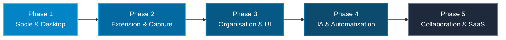

# 🚀 Roadmap LinksVault — Vision & Plan de Développement

Ce document définit les étapes clés, les priorités et l'architecture fonctionnelle pour faire de **LinksVault** la solution ultime de gestion intelligente de liens et de connaissances (Web, Desktop & Extension).

---

---

## 📌 Synthèse des Phases

| Phase | Domaine | Objectifs Principaux | Statut |
|---|---|---|:---:|
| **Phase 1** | **Socle & Desktop** | Multi-tenancy, Auth, Packaging NativePHP Electron Windows/macOS | 🟢 **Prêt** |
| **Phase 2** | **Extension Clipper** | Capture 1-clic, extraction OpenGraph/YouTube, Token Sanctum | 🟡 **En cours** |
| **Phase 3** | **Organisation & UX** | Vues Grille/Liste/Table, Dossiers partagés, Recherche instantanée | ⚪ *À venir* |
| **Phase 4** | **IA & Intelligence** | Résumés automatiques, auto-tagging, Chat RAG sur les signets | ⚪ *À venir* |
| **Phase 5** | **Collaboration & SaaS** | Subbase Abonnements, Export/Import (Pocket/Chrome), Sync Cloud | ⚪ *À venir* |

---

## 🎯 Détail des Jalons

### 🔹 Phase 1 : Socle Technique, Authentification & Desktop (Complétée)
- [x] **Multi-Tenancy (FilaTeams)** : Espaces personnels automatiques + équipes partagées.
- [x] **Authentification & Permissions** : Filament v5 Auth, rôles (Propriétaire, Admin, Membre).
- [x] **NativePHP Desktop** : Configuration de la fenêtre Electron, persistance des états, support du serveur interne.
- [x] **Suite de tests automatisés** : Tests fonctionnels d'inscription, connexion et isolation des tenants.
- [x] **Identité visuelle** : Intégration du logo HD sur tous les panels et fenêtres.

---

### 🔹 Phase 2 : Extension Navigateur & Moteur de Capture
- [ ] **Connexion fluide** :
  - Authentification simple par identifiants (génération automatique du token Sanctum).
  - Détection automatique du statut du serveur local (Desktop port 8100 ou Web).
- [ ] **Capture intelligente des métadonnées** :
  - Extraction automatique : Titre, Favicon, Description, Image OpenGraph, Auteur, Temps de lecture.
  - Détecteur spécialisé pour **YouTube** (ID vidéo, vignette HD, durée) et **GitHub** (Repo stats).
- [ ] **Enrichissement à la volée** :
  - Choix du Workspace, Dossier cible, Catégorie et ajout de tags via auto-complétion.
  - Sauvegarde en un clic avec raccourci global (`Alt + S`).
- [ ] **Menu contextuel navigateur** :
  - Enregistrer la page courante, un lien ciblé ou une sélection de texte.

---

### 🔹 Phase 3 : Organisation Avancée & Expérience Utilisateur (UI/UX)
- [ ] **Vues dynamiques personnalisables** :
  - **Vue Cartes (Grid)** avec aperçus visuels et lecteur vidéo intégré.
  - **Vue Table / Liste compacte** pour la productivité et la gestion de masse.
  - **Vue Kanban** par statut de lecture (*À lire*, *En cours*, *Archivé*).
- [ ] **Dossiers & Arborescence** :
  - Dossiers imbriqués avec glisser-déposer (drag & drop).
  - Partage de dossiers avec des collaborateurs avec permissions fines (*Lecteur* / *Éditeur*).
- [ ] **Moteur de Recherche & Filtrage Instantané** :
  - Recherche plein texte sur le titre, l'URL, la description et les notes personnelles.
  - Filtres combinés : par domaine, date d'ajout, tag, catégorie, favoris.

---

### 🔹 Phase 4 : Intelligence Artificielle & Analyse (Laravel AI SDK)
- [ ] **Résumé de contenu assisté par IA** :
  - Génération automatique d'un résumé concis des articles et vidéos sauvegardés.
- [ ] **Auto-Tagging & Classification** :
  - Suggestion de tags pertinents et détection automatique de la catégorie.
- [ ] **Chat avec votre coffre-fort (RAG)** :
  - Possibilité de poser des questions à l'IA sur l'ensemble des pages enregistrées dans votre espace.

---

### 🔹 Phase 5 : Collaboration, Import/Export & Monétisation
- [ ] **Importateur universel** :
  - Importation en un clic des signets Chrome, Firefox, Safari, Pocket, Raindrop.io et CSV.
  - Exportation complète des données au format JSON/HTML standard.
- [ ] **Gestion des Abonnements (Subbase)** :
  - Plans Gratuit / Pro / Équipe avec limitation du nombre de liens et fonctionnalités IA.
- [ ] **Intégrations Cloud** :
  - Sauvegarde automatique sur Google Drive, Dropbox ou S3.
